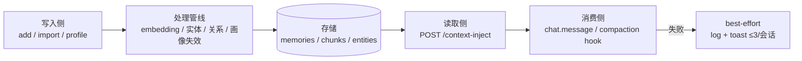

# Memory Recall 核心数据流（写入 → 处理 → 召回/注入 → 消费）

> 状态: ACTIVE · 版本: v1.0 · 最后更新: 2026-08-12
> 关联: [ENTITY_DESIGN.md](ENTITY_DESIGN.md)、[PROJECT_PLAN.md](PROJECT_PLAN.md)、ADR-0003~0008

本文档描述 Memory Recall 的**动态流程**：记忆从写入、处理、存储，到召回/注入、被插件消费的完整链路。
领域模型与表结构见 [ENTITY_DESIGN.md](ENTITY_DESIGN.md)；本文档涉及"已决策、待实施"的变更会标注 ADR 引用。

## 1. 总览



## 2. 写入路径

| 入口 | 端点 / 工具 | 说明 |
|------|------------|------|
| 显式记忆 | `POST /memories`（插件 `memory-recall` add） | `content` / `is_static` / `metadata` / `entity_context`；`async_process=true` 先返回 `processing`，后台完成 embedding/实体/关系 |
| 文档知识 | documents API + 插件 document-tracker / file-watcher | 导入、分块、向量化；删除/更新语义见 ISSUES MR-001~MR-003 |
| 画像 | profile + `entity-context` | 静态（永久特征）与动态（近期活动）；add 时携带 `entity_context` 或读取已有上下文 |
| 遗忘/修订 | forget / restore / `POST /memories/{id}/update` | 显式更新建版本链（1:1）；自动关系检测把旧记忆降级 `is_latest=FALSE`（N:1）——两种语义并存，勿混用 |

写入侧约定：

- 静态记忆在写入时打分类标记（`_classification`：行为规则 vs 临时记录），与召回侧
  `TRANSIENT_STATIC_MARKERS` 共用同一套正则，防读写漂移；
- 会话摘要是会话状态，**不写入记忆库**（[ADR-0006](decisions/0006-session-summary-not-stored-as-memory.md)）。

## 3. 处理管线

写入后（同步或后台）按序处理：

1. **向量化**：embedding（火山引擎 doubao，OpenAI-compatible）；
2. **实体抽取**：LLM 抽取 + 规则降级；
3. **关系检测**：`updates / extends / derives` 三类；自动检测失败降级规则检测；
4. **画像缓存失效**：`profile_service.invalidate_cache`；
5. **失败可见**：异步任务状态可查询（纯内存队列限制见 ISSUES MR-004）。

## 4. 存储

- 表：`memories` / `documents` / `chunks` / 实体与关系表 / profile 缓存；`apps/api/schema.sql` 是唯一事实源；
- 取代语义：显式版本链（1:1）与自动降级（N:1）并存；大量 `is_latest=FALSE, version=1` 的"孤儿旧版本"
  是设计产物，不是数据损坏；
- 容器隔离：存储层沿用 `container_tag`；插件与 `/context-inject` 使用 `user_tag/project_tag`
  （auth `verify_container_ownership` 支持精确匹配或 `{key_id}_` 前缀）。

## 5. 读取路径（/context-inject）

`POST /context-inject` 是**唯一召回入口**（[ADR-0003](decisions/0003-inject-api-convergence.md)，
旧 `container_tag` 模式已移除，仅支持 `user_tag/project_tag`）。

### 请求

- `user_tag` / `project_tag`：容器（缺省回退当前 API Key 的 container_tag）；
- `query`：可为空（纯画像注入）；
- `config`：数量上限（profile/memories/chunks）、图谱 depth/nodes、相似度阈值、去重与语言等；
- `include_trace`：是否附召回链路明细。

### 召回链路

```
profile（画像） → memory vector（记忆向量） → memory graph（记忆演进）
→ entity graph（实体关系） → chunks（文档分块）
→ 语义去重（SOURCE_PRIORITY） → cap（统一在去重后应用） → Markdown 格式化
```

### 响应

- `context`：给 LLM 读的 Markdown（画像 → 项目记忆 → 用户记忆 → 文档分区；中英自动检测；空结果返回 `""`）；
- `sources`：结构化引用（含 id，供插件记账）；
- `stats`：去重/上限统计；
- `trace`：`include_trace=true` 时附召回链路与各通道结果。

### 降级语义（[ADR-0004](decisions/0004-context-inject-graceful-degradation.md)）

- 单通道失败：返回已成功通道结果，失败记入 `failed_channels`（trace/stats）；
- 全部通道失败或请求级错误（鉴权/参数/存储不可用）：才返回 500。

## 6. 消费侧（插件）

### chat.message 注入

- 挂 `chat.message` hook，把 synthetic text part unshift 到用户消息头部；
- `injectionStrategy`：once / smart（默认）/ always；smart 随会话增长收窄注入量；
- `injectedMemoryIds` 记账，避免同会话重复注入同一条记忆；
- 目标态只走 `/context-inject` 后端聚合，前端复合路径已删除（ADR-0003）。

### compaction 注入

- `experimental.session.compacting` 只 push `output.context`（AI guidance + 项目记忆），
  不替换默认 prompt（[ADR-0007](decisions/0007-compaction-converge-to-official-hook.md)）；
- 摘要捕获与现场恢复已决策删除（[ADR-0008](decisions/0008-remove-summary-capture-and-scene-recovery.md)）；
- agent/model/todos 由 opencode 官方保留，插件不再做恢复。

### 失败提示（[ADR-0005](decisions/0005-inject-failure-notice-policy.md)）

- log + toast，按会话最多 3 次；第 3 次提示"后续错误不再显示，详情见日志"；
- 错误详情不写入对话消息，不污染注入上下文；
- 注入整体 best-effort：任何失败不阻塞主流程。

## 7. 关键约定

1. **注入是锦上添花**：失败不阻塞对话，这是生存底线；
2. **单一召回入口**：去重/图谱/cap/trace 只在后端维护；
3. **会话状态与知识分离**：会话摘要不进记忆库；
4. **可观测**：trace 能回答"哪条记忆死在哪一环"。

## 8. 与相关文档的关系

- 静态模型与表结构 → [ENTITY_DESIGN.md](ENTITY_DESIGN.md)；
- 路线图与不做清单 → [PROJECT_PLAN.md](PROJECT_PLAN.md)；
- 已知问题 → [ISSUES.md](ISSUES.md)；
- 决策历史 → [decisions/](decisions/README.md)。
