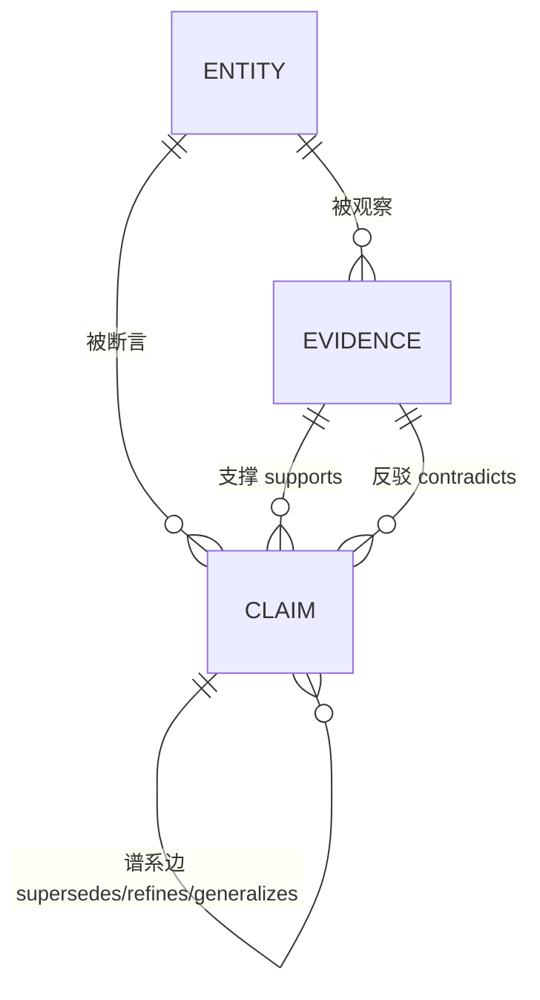

# 2026-08-14: Agent Memory 的「状态有效性」转向 —— 一条 thread 的调研与展开

> 类型: 调研
> 日期: 2026-08-14
> 关联: [命题晋升总纲](2026-08-14-proposition-promotion.md) · [memory-confidence](2026-08-14-memory-confidence.md) · [memory-layering-and-recall](2026-08-14-memory-layering-and-recall.md) · [ENTITY_DESIGN.md](../ENTITY_DESIGN.md)

## 背景

用户分享了一条 X 推文串（作者 @msjiaozhu / MapleShaw），问"对我们是否有启示"。
随后明确了两点方向：

1. **当前系统代码与既有设计（含 schema、`is_latest` 等标志位、"N:1 vs 1:1 取代语义"等决策）只作为现状与参考，不构成约束**——可以推翻重来。
2. **渐进式重构**，不搞大爆炸；当前更关心"怎样才是对的"，而非"如何在现有结构上打补丁"。

本篇记录该 thread 的核心观点、一份外部 AI（Grok）的交叉分析，以及在此基础上形成的**第一性原理目标模型**（北极星），供后续重构时引用。

来源：https://x.com/msjiaozhu/status/2087842698661347768

## 调研发现

### 1. Thread 逐条要点（共 9 条）

作者主张的核心一句话：**Agent Memory 的难点已从"怎样把过去的信息找回来（检索/RAG）"转移到"它找回来的那条信息，现在还成立吗（状态有效性 / 长期上下文）"。**

| # | 要点 |
|---|------|
| 1/9 | 多数 Agent Memory 讨论仍停留在"如何找回过去信息"；但跨项目、跨月工作后，更难的是"找回来的信息现在还成立吗"。引 AlloomiAI 的 Holistic Context——不是"再加一层记忆"，而是"当信息持续更新、结论不断被修正时，Agent 能否理解过去如何演变成现在"。OpenContext 是其开放出来的一个切面。 |
| 2/9 | 专业服务场景的 gap：客户目标改过三次、合同多版本、风险判断被新证据推翻、同一联系人在两项目角色不同。RAG 能找回旧邮件/文档/结论，但**不天然知道**：哪个版本已被替代、哪个判断只在当时成立、新信息改变了什么、当前应以哪个状态继续。这是**状态有效性**问题，不是记忆容量问题。 |
| 3/9 | 提出技术分野：① **检索回答**——过去哪里说过这件事？② **长期上下文回答**——过去发生了哪些变化、为什么今天应以这个状态为准？后者不需要更大的向量库，而是把人物/项目/会话/文件/任务/结果放进**同一套可演变的上下文结构**。Holistic Context 拆成几层：统一实体、关系网络、时间轨迹、动态更新、证据链。 |
| 4/9 | 研究结果之一：信息更新与多会话理解。LongMemEval-S 考察长期信息提取、知识更新、多会话综合推理；Alloomi 报告 97.6%（人类参考 82.9%）。价值在于把"旧信息还在"与"新信息已更新旧状态"区分开。 |
| 5/9 | 研究结果之二：跨时间关系。问题不是"某条信息是否出现过"，而是：谁先做的判断？在什么背景下形成？后来是否被修正？两条分散在不同会话里的信息是否指向同一件事？LoCoMo-V2 报告 97.4%。"多塞一点上下文"≠解决长期记忆。 |
| 6/9 | 研究结果之三：规模不是 window size。128K 能装长内容，但真实工作是"不断增长、不断更新、关键线索稀疏"的历史系统。BEAM 10M 报告 67.0%。核心问题：历史扩到 10M Token，Agent 是否还找得到关键线索并维持对"全局状态"的理解。 |
| 7/9 | 技术突破：记忆不应只有"写入"和"召回"。把"事实"从一次性文本片段，变成**具有时间有效性、关系与修正轨迹的对象**。它能表达：何时成立、何时被新证据替代、与哪些判断支持/冲突、在某个历史时点系统应当相信什么。 |
| 8/9 | 研究不只要"记得住"，还要证明"做得成"。三层评测：✅记得住（LoCoMo-V2 / LongMemEval-S / BEAM 10M）✅学得会（CL-Bench / CL-Bench-Life / Con.L Bench）✅做得成（GDPval-AA / JobBench / SWE-Bench-CL）。能力不应只靠"记住了多少"判断，还要看能否从经验学习并转化为稳定交付。 |
| 9/9 | 收束：长期 Agent 的下一步不是"再接一个记忆库"，而是让系统持续回答四个更难的问题——**①哪些历史仍有效？②哪些结论已被新证据推翻？③当前任务继承的是哪段经验？④系统为什么相信这是现在应当采取的状态？** 资料入口：Holistic Context 报告 + OpenContext。 |

### 2. 外部 AI（Grok）交叉分析要点

用一份包含系统背景的提示词问了 Grok，其结论方向一致，要点：

- 现有系统已覆盖"实体-关系网络 + 时间字段 + 版本链"，差距在：**证据链、支持/冲突关系、召回时可解释的"为何相信"**。
- 建议：统一取代语义、召回时即时有效性验证、证据加权、"记得住/学得会/做得成"分层评测。
- 可执行产物：5 类状态正确性评测场景（版本替代 / 时间切片 / 证据推翻 / 跨会话同一事件 / 负例不误杀）。

注意：Grok 的"统一取代语义"等建议仍以"保留现有代码结构"为前提。在"可推翻重来"的前提下，这些建议全部降级为参考，目标模型另起（见下）。

### 3. 第一性原理展开：正确的目标模型

前提：现有 `memories` 表是"文本 + 一堆标志位"的大杂烩，`is_latest` 需手工维护、证据与结论混在一起。正确模型把"记忆"对象重新定义。

**四类对象（替代单一 memories 大杂烩）：**

1. **Evidence（证据，不可变，append-only）**——系统"地面真相"。一次原始观察：某次会话的一句话、一段代码事实、一个文档片段、一个外部事实。字段：`observed_at`、`source_kind`（session/document/observation）、`content`、`entities[]`、embedding。**永不改写、永不静默删除**；证据不存在"过期"，只有"某结论基于它、后来被新证据推翻"。
2. **Claim（主张/结论，可版本化）**——系统"认知状态"。一个断言："项目用 Postgres""用户偏好 X""决策 Z 生效中"。字段：`statement`、`entities[]`、`valid_from`、`valid_until`（可空=至今成立）、`status`（active/superseded/retracted/disputed）、`confidence`、`evidence_refs[]`、embedding。**Claim 是对若干 Evidence 的"结论"**——现有系统完全没有这一层。
3. **Lineage Edge（谱系边）**——即 thread 说的"修正轨迹"：`claim A --[supersedes|contradicts|refines|generalizes, reason]--> claim B`。`is_latest` 不再是手工标志位，而是**派生视图**："没有出边的 claim 即当前最新"。N:1 / 1:1 取代语义的纠结在此自动消失（谱系是 DAG，"最新"是一次查询）。
   > 2026-08-18 演进注：本条及下方不变量 2 中的 `triggered_by_evidence`（触发证据）已从 Lineage Edge **移除**，
   > 改由独立审计日志 `claim_activity` 承载（v1 #35 / entity-attributes §5.1）——边只保留叙述性 `reason`，
   > 因果追溯走日志；重建 = 按时间重跑对账（接受 LLM 不确定性）。
4. **Entity（实体锚点/粒度）**——person/project/topic/decision；Evidence 与 Claim 都挂到实体上，实现"跨会话同一件事"的绑定，是"关于 X 现状如何、怎么变过来的"的入口。

**5 条正确性不变量（每个设计决策的判据）：**

1. 证据与结论分离：结论必须能引用证据；证据不可变。
2. 任何状态变更 = 一条谱系边（type + reason + 触发证据），**绝不静默覆盖**。
3. 时间有效性是一等公民："现在"只是时间轴上的一个点，检索在任意 T 都能切片。
4. "当前状态"永远派生，不是手工维护的标志位。
5. 任何召回结果都能回答四问：①现在还成立吗？②被什么取代/推翻？③证据是什么？④在 T 时刻系统信的是什么？（= thread 第 9 点的四个问题，应为召回接口的**默认契约**，而非"将来高级功能"）

**两条链路被重新定义：**

- **写路径 = 对账（reconciliation）**，而非"追加一条"：新 Evidence 进来 → 锚定实体 → 与当前 active claims 比对 → 冲突则 supersede（新 Claim + 边 + reason + 证据）；新事实则建 Claim 并挂证据；冗余则 reinforce（追加证据引用、提升 confidence）。
- **召回路径 = 状态查询**，而非"相似度排序"：query → 实体/向量定位候选 Claim → 沿谱系取末端 + 有效性区间 + 证据摘要 → 回答四问。

真正难处不在 schema，而在**对账那步的冲突判定**："两条是否同一事实""新证据是否真推翻了旧结论"——LLM 依赖最强、最易错，也是评测集要盯住的地方。

### 4. 与现有命题晋升工作的关系（待厘清）

现有活跃方向「命题晋升」已提出"记忆即命题、按价值晋升/降级、置信度拆两轴（内容∥复用）"。本篇的目标模型与其**高度同源**（都把"记忆"当作带生命周期的命题），但存在一个待收敛的分野：

- 命题晋升当前更偏**"这条命题值不值得留"（价值/晋升/遗忘）**；
- 本篇目标模型更偏**"这条命题现在是不是真的、为什么"（状态有效性/证据/谱系）**。

二者不是对立，可能是同一对象的两面。具体关系留作未决问题，待后续对齐。

## 结论

1. Thread 的核心命题成立且方向正确：长期 Agent 记忆的第一等公民是**状态有效性**，不是检索命中。
2. "怎样是对的"可收敛为四类对象（Evidence / Claim / Lineage / Entity）+ 5 条不变量 + 两条链路（对账写入 / 状态查询召回）。
3. 整个重构里最大的一次概念翻转是**证据/结论分离**；其余（时间有效性、谱系图、"当前状态派生"）都是它的自然推论。
4. 渐进重构无需回头推倒，每一阶段都朝上述模型收敛。

## 下一步

1. （尚未开始）写《目标模型》设计文档（北极星 + 4 对象 + 5 不变量 + 两链路 + 渐进路径），作为后续增量重构的唯一裁判。
2. 动笔前需用户拍板两个问题（见"未决问题" 1、2）。
3. 视对齐结果，决定是否落 ADR（如"证据/结论分离""当前状态派生，废除 is_latest 标志位"这类方向性取舍）。

## 未决问题

1. **Claim 的 `statement` 结构粒度**：记忆主要存"关于人/项目的事实与偏好"（简单断言），还是也包括"决策、结论、推理过程"（需表达"因为 X 所以 Y"，结构复杂得多）？
2. **"证据/结论分离"是否作为正确模型的地基**（这是最大的概念翻转，其余是它的推论）——待用户确认。
3. 本模型与现有「命题晋升 S0–S5」是同一对象的两面还是两套体系？是否需要合并、或明确边界？
4. 渐进路径的 Stage A（4 对象新 schema 与旧表并存、旧数据只读迁移）何时启动、迁移粒度如何？
